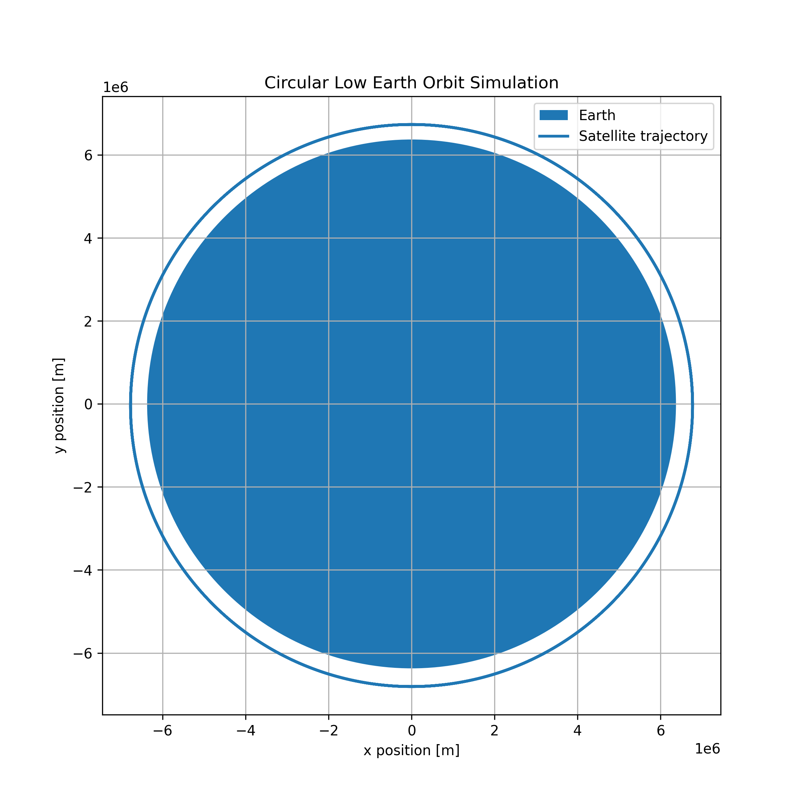
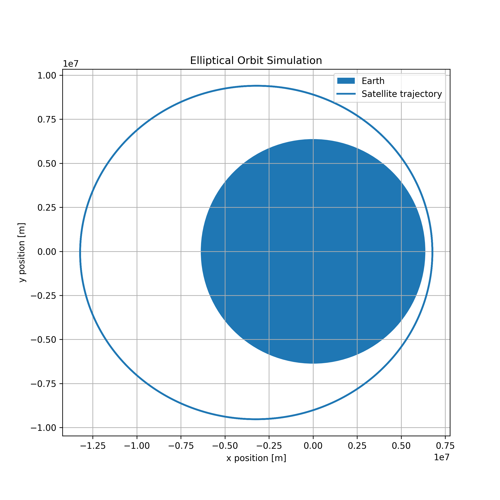
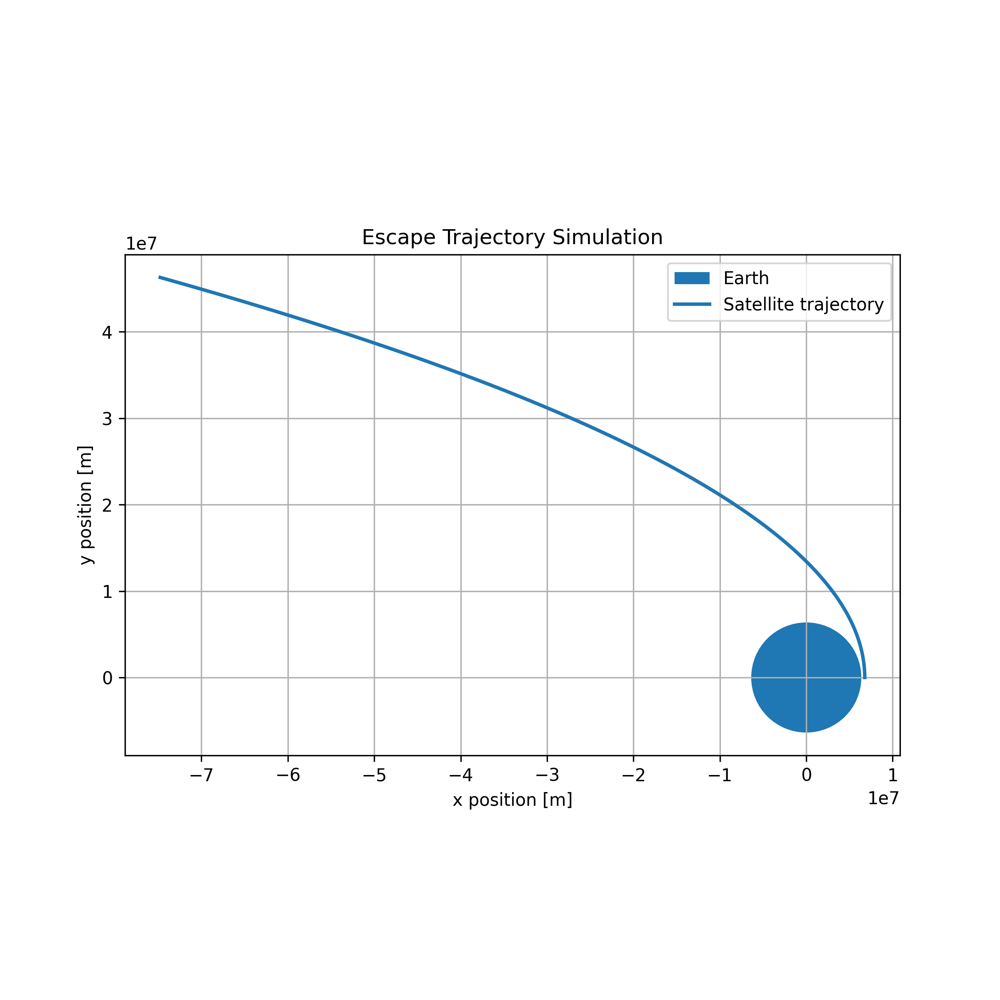

# Orbital Mechanics Simulator

This project simulates two-body orbital motion using Newtonian gravity and numerical integration techniques.

The simulator models a satellite orbiting Earth and visualizes the resulting trajectory. The project demonstrates concepts from classical mechanics, orbital dynamics, and scientific computing that are relevant to aerospace engineering and astrodynamics.

---

## Skills Demonstrated

- Python Programming
- Scientific Computing
- Numerical Integration
- Orbital Mechanics
- Classical Mechanics
- Data Visualization
- Simulation and Modeling

---

## Example Output

### Circular Orbit Simulation

This figure shows a satellite in low Earth orbit propagated using Newtonian gravitational dynamics.

## Orbit Types

### Circular Orbit

A satellite initialized at the circular orbital velocity remains at a constant orbital radius.

### Elliptical Orbit

Increasing the orbital velocity above the circular value produces a stable elliptical orbit with distinct perigee and apogee distances.

### Escape Trajectory

Initializing the satellite at the escape velocity produces an unbound trajectory that allows the spacecraft to leave Earth's gravitational influence.

## Physical Model

The simulation uses Newton's Law of Gravitation:

F = GMm/r²

which produces the acceleration:

a = -GMr/|r|³

The equations of motion are integrated numerically to determine the satellite's trajectory over time.
